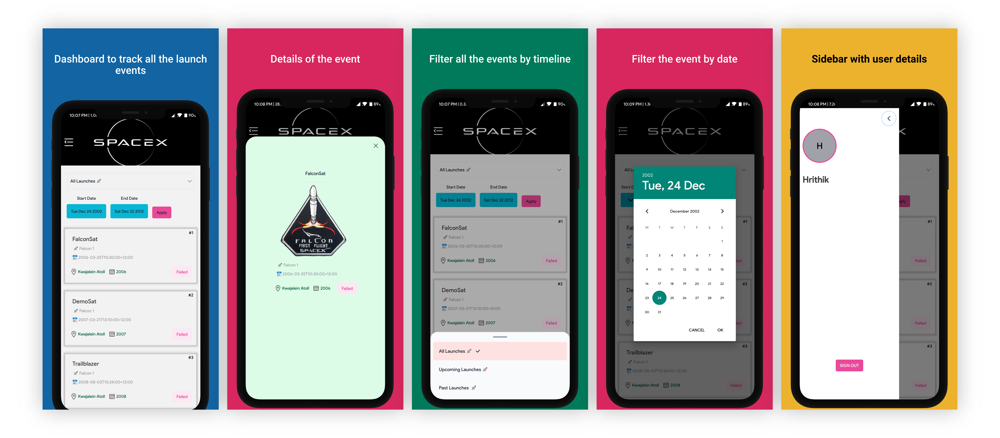

# SpaceX Dashboard :rocket:



Try the demo apk [here](https://expo.dev/accounts/hrithiksingh._/projects/spacex-dashboard/builds/c78adb4a-23f3-4094-a810-dfe726a1e7a5)

## Stack

- [React Native](https://reactnative.dev/) - ReactJS-based framework that can use native platform capabilities
- [Expo](https://expo.dev/) - Toolset for building and delivering RN apps
- [React Navigation(v6)](https://reactnavigation.org/) - Routing and navigation
- [NativeBase(v3)](https://nativebase.io/) - Themable component library
- [React-Redux](https://redux.js.org/) - State Mangerment to manage users only
- [Firebase](https://firebase.google.com/) - Authentications
- [react-native-community/datetimepicker](https://www.npmjs.com/package/@react-native-community/datetimepicker) -React Native Date Picker

## How to dev

This project can be run from the Expo client app.

```sh
yarn
yarn start
```
